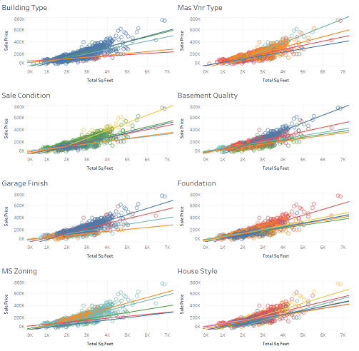

# Overview
  
This notebook assesses a housing dataset for Ames, Iowa providing the opportunity to use regression techniques for house prices with 79 explanatory variables. These variables include many attributes about the house including square footage, amenities, exterior conditions, neighborhood, year built/sold, rooms/bathrooms amongst many others.  
  
My analysis follows:  
  
1. Data Loading  
2. Data Cleaning  
3. Feature Engineering  
4. Regression Model & Model Tuning
5. Final Model & Discussion
  
The final result is a model that produces an RMSLE on the holdout set of 0.11913.  
  
The data set is available <a href="https://www.kaggle.com/c/house-prices-advanced-regression-techniques/overview">here</a>.
  
# 1. Data Loading  
## Initialize Libraries
```{r}
library(Hmisc) #impute
library(dplyr)
library(writexl)
library(caret) #dummy vars
library(glmnet)
```

## Load train and test data set

I loaded both the training and holdout datasets into 1 dataframe. I created a column to identify them so that I can split them out later. Next, I addressed the missing values. When importing the dataset into R, R replaced some categorical values of “NA” with null. I added these back. A few fields were truly missing values, to which I imputed with median for numeric variables and mode for categorical variables.

```{r}
df <- read.csv("C:\\Users\\jdonv\\OneDrive - Queen's University\\Predictive Analytics\\A1-Housing\\train.csv")
```

```{r}
df_test <- read.csv("C:\\Users\\jdonv\\OneDrive - Queen's University\\Predictive Analytics\\A1-Housing\\test.csv")
```

```{r}
df_test$SalePrice <- 0
df_test$SalePrice <- as.integer(df_test$SalePrice)
df_test$Set <- "Test"
df$Set <- "Train"
```

Merge the datasets to save us time with processing
```{r}
df_new <- rbind(df, df_test)
```

```{r}
str(df_new)
```

# 2. Data Cleaning  
We want to ensure our categorical and numerical variables are coded properly. We start by recoding some variables into factors or integers.

```{r}
df_new$MSSubClass <- as.factor(df_new$MSSubClass)
df_new$MoSold <- as.factor(df_new$MoSold)
df_new$YrSold <- as.factor(df_new$YrSold)
df_new$GarageYrBlt <- as.integer(df_new$GarageYrBlt)
```

Identify columns with missing values.
```{r}
colnames(df_new)[colSums(is.na(df_new)) > 0]
```

Some fields have missing values that are supposed to be coded as "NA" to which R removed when importing. 
```{r}
na_list <- c("Alley", "BsmtQual", "BsmtCond", "BsmtExposure", "BsmtFinType1", "BsmtFinType2", "GarageType", "GarageYrBlt", "GarageFinish", "GarageQual", "GarageCond", "FireplaceQu", "PoolQC", "Fence", "MiscFeature")

```

We need to convert them to characters first
```{r}
df_new <- mutate_at(df_new, vars("Alley", "BsmtQual", "BsmtCond", "BsmtExposure", "BsmtFinType1", "BsmtFinType2", "GarageType", "GarageYrBlt", "GarageFinish", "GarageQual", "GarageCond", "FireplaceQu", "PoolQC", "Fence", "MiscFeature"), as.character)
```

```{r}
df_new[, na_list][is.na(df_new[, na_list])] <- "NA"
```

We convert back to Factor after filling in the missing values.
```{r}
df_new <- mutate_at(df_new, vars("Alley", "BsmtQual", "BsmtCond", "BsmtExposure", "BsmtFinType1", "BsmtFinType2", "GarageType", "GarageYrBlt", "GarageFinish", "GarageQual", "GarageCond", "FireplaceQu", "PoolQC", "Fence", "MiscFeature"), as.factor)
```

Use simple median or mode imputation for remaining missing values. Median was used for numeric missing values and mode for categorical. Reference: https://medium.com/coinmonks/dealing-with-missing-data-using-r-3ae428da2d17 
```{r}
df_new$LotFrontage <- with(df_new, impute(LotFrontage, median))
df_new$MasVnrArea <- as.integer(with(df_new, impute(MasVnrArea, median)))
df_new$MasVnrType <- with(df_new, impute(MasVnrType, mode))
df_new$Electrical <- with(df_new, impute(Electrical, mode))

#from test set:
df_new$MSZoning <- with(df_new, impute(MSZoning, mode))
df_new$Utilities <- with(df_new, impute(Utilities, mode))
df_new$Exterior1st <- with(df_new, impute(Exterior1st, mode))
df_new$Exterior2nd <- with(df_new, impute(Exterior2nd, mode))
df_new$KitchenQual <- with(df_new, impute(KitchenQual, mode))
df_new$GarageCars <- as.integer(with(df_new, impute(GarageCars, median)))
df_new$GarageArea <- as.integer(with(df_new, impute(GarageArea, median)))
df_new$Functional <- with(df_new, impute(Functional, mode))
df_new$SaleType <- with(df_new, impute(SaleType, mode))

na_list<- c("BsmtFinSF1", "BsmtFinSF2", "BsmtUnfSF", "TotalBsmtSF", "BsmtFullBath", "BsmtHalfBath")  
df_new[, na_list][is.na(df_new[, na_list])] <- 0
```

Gut check to see if all missing values have been addressed.
```{r}
colnames(df_new)[colSums(is.na(df_new)) > 0]
```

# 3. Feature Engineering

Reviewing the data dictionary, I added more features that may add predictive power to the model. They were:  
1.	Total Square Feet: Sum of above ground square feet and basement square feet  
2.	Remodeled: If the year remodeled = year built, then it is not remodeled  
3.	Total Porch Square Feet: Sum of all different types of porch square feet  
4.	Porch Included: If Total Porch Square Feet > 0, then there’s a porch  
5.	Bathrooms: Sum of all types of bathrooms

```{r}
df_new$Remodeled <- ifelse(df_new$YearRemodAdd == df_new$YearBuilt, 0, 1)
df_new$TotalPorch <- df_new$OpenPorchSF + df_new$EnclosedPorch + df_new$X3SsnPorch + df_new$ScreenPorch
df_new$Porch <- ifelse(df_new$TotalPorch>0,1,0)
df_new$TotalSqFeet <- df_new$GrLivArea + df_new$TotalBsmtSF
df_new$TotalBathroom <- df_new$BsmtHalfBath + df_new$FullBath + df_new$HalfBath + df_new$BsmtFullBath
```

## Outliers
I can see from the scatter plot below the presence of outliers.
```{r}
ggplot(df_new %>% filter(Set=="Train")) +
 aes(x = TotalSqFeet, y = SalePrice, colour = BldgType) +
 geom_point(size = 1L) +
 scale_color_hue() +
 theme_minimal()
```

I removed the 2 outliers which could impact the model since they appear to be far out from the general trend depicted when plotting Price and Total Square Feet.  
```{r}
df_new <- df_new %>% filter(TotalSqFeet <= 7500 & Set=="Train" | Set=="Test")
```

## Log Transformations
For some numeric features exhibiting skew, it may be a good idea to log transform them. I log-transformed the Total Square Feet feature, which I hypothesized could add predictive power.

```{r}
ggplot(df_new) +
 aes(x = TotalSqFeet) +
 geom_histogram(bins = 30L, fill = "#0c4c8a") +
 scale_x_continuous(trans = "log") +
 theme_minimal()
```

```{r}
df_new$TotalSqFeetLog <- log(df_new$TotalSqFeet)
```

# 4. Regression Model & Model Tuning

For my baseline model, I have no interactions. I began by creating dummies, then splitting the data into train and test data sets (70-30 split). I used the lasso regression from glmnet with a lambda of -5.3 to get a baseline RMSLE of 0.1038966. The baseline allows me to test different variations of the models to see if I can improve the test RMSLE. At this point I also submitted used this model to predict the Sale Prices on the holdout set. The holdout set scored 0.12009 on Kaggle.

## Initial Model - No Interactions
```{r}
df_d<-model.matrix(Id~., df_new) #make dummies
df_d<-as.data.frame(df_d)
```

```{r}
df_d$SalePriceLog<-log(df_d$SalePrice) #training data only
```

Split the data into training model and hold out
```{r}
df.M <- filter(df_d, SetTrain == 1) %>% select(-SetTrain, -SalePrice) #model
df.H <- filter(df_d, SetTrain == 0)  %>% select(-SetTrain, -SalePrice) #holdout
```

### Initial Model: Train-Test Split
```{r}
# Random sample indexes

set.seed(57)
train_index <- sample(1:nrow(df.M), 0.70 * nrow(df.M))
test_index <- setdiff(1:nrow(df.M), train_index)

X_train <- df.M[train_index, !names(df.M) %in% c("SalePriceLog")]
X_test <- df.M[test_index, !names(df.M) %in% c("SalePriceLog")]

y_train <- df.M[train_index,"SalePriceLog"]
y_test <- df.M[test_index,"SalePriceLog"]

X_holdout <-df.H[, !names(df.H) %in% c("SalePriceLog")]
y_holdout <- df.H[,"SalePriceLog"]

X_all <- df.M[, !names(df.M) %in% c("SalePriceLog")]
y_all <- df.M[,"SalePriceLog"]
```

Chart out initial model and show lambda values and coefficients.
```{r}
lasso.fit<-glmnet(x = as.matrix(X_train), y = y_train, alpha = 1)
plot(lasso.fit, xvar = "lambda") #observe that as lambda increases then variables decrease
```

```{r}

#selecting the best penalty lambda
crossval <-  cv.glmnet(x = as.matrix(X_train), y = y_train, alpha = 1) #create cross-validation data
plot(crossval)
```
```{r}
penalty.lasso <- crossval$lambda.min #determine optimal penalty parameter, lambda
log(penalty.lasso) #see where it was on the graph
```

We re-run the model with the optimal lambda.
```{r include=FALSE}
lasso.opt.fit <-glmnet(x = as.matrix(X_train), y = y_train, alpha = 1, lambda = penalty.lasso) #estimate the model with the optimal penalty
coef(lasso.opt.fit) #resultant model coefficients
```

```{r}
rmsle <- function(y_true, y_pred)
    sqrt(mean((log1p(y_true) - log1p(y_pred))^2))
```

We now use the model on the test set to get the MAPE and RMSLE.
```{r}

# predicting the performance on the testing set
lasso.testing <- exp(predict(lasso.opt.fit, s = penalty.lasso, newx =as.matrix(X_test)))
mean(abs(lasso.testing-exp(y_test))/exp(y_test)*100) #calculate and display MAPE
```


```{r}
rmsle(lasso.testing, exp(y_test))
```

### Initial Model: Retrain Model and Holdout Set
Next I retrain on the entire dataset to predict on Kaggle.

```{r}

#selecting the best penalty lambda
crossval <-  cv.glmnet(x = as.matrix(X_all), y = y_all, alpha = 1) #create cross-validation data
plot(crossval)
```

```{r}
penalty.lasso <- crossval$lambda.min #determine optimal penalty parameter, lambda
lasso.opt.fit <-glmnet(x = as.matrix(X_all), y = y_all, alpha = 1, lambda = penalty.lasso) #estimate the model with the optimal penalty

```

```{r}
lasso.holdout <- exp(predict(lasso.opt.fit, s = penalty.lasso, newx =as.matrix(X_holdout)))
results <- data.frame(lasso.holdout)
#write_xlsx(results, "C:\\Users\\jdonv\\OneDrive - Queen's University\\Predictive Analytics\\A1-Housing\\predictions_1.xlsx")
```

The RMSLE from Kaggle is 0.12009. 

## Model Tuning - Adding Interactions
I used Tableau to investigate some hypothesized features to which the interactions with other features could have predictive power. Mainly, I focused on their interaction with Total Square Feet and looked for features where the categorical values showed different slopes vs the price. A few examples are below:



I tested various combinations of BldgType, Sale Condition, TotalSqFeet, MasVnrType, BsmntQual and Condition1. The results are below and shows that the Cross Interactions model has the best result.  In the future, I would create a for loop to manage testing various interactions. Presently, in this notebook, the below code was manually modified several times to test these cases.

**Run**|**Model**|**Test RMSLE**|**Holdout RMSLE**
:-----:|:-----:|:-----:|:-----:
1|No Interactions|0.1038966|0.12009
5|TotalSqFeet*BldgType|0.1037733|0.12004
4|TotalSqFeetBldgType+TotalSqFeetSaleCondition|0.1033175|0.11968
3|TotalSqFeetBldgType+TotalSqFeetSaleCondition+TotalSqFeet*MasVnrType|0.1032476|0.11965
7|TotalSqFeetBldgType+TotalSqFeetSaleCondition+TotalSqFeetMasVnrType+TotalSqFeetBsmtQual+TotalSqFeet*Condition1|0.1033596|0.1196
2|TotalSqFeetBldgType+TotalSqFeetSaleCondition+TotalSqFeetMasVnrType+TotalSqFeetBsmtQual|0.1032478|0.1195
6|TotalSqFeetBldgTypeSaleConditionMasVnrTypeBsmtQual|0.1054041|0.11913

```{r}
df_d<-model.matrix(Id~.+TotalSqFeet*BldgType*SaleCondition*MasVnrType*BsmtQual, df_new) #make dummies
df_d<-as.data.frame(df_d)
df_d$SalePriceLog<-log(df_d$SalePrice)
```

```{r}
df.M <- filter(df_d, SetTrain == 1) %>% select(-SetTrain, -SalePrice) #model
df.H <- filter(df_d, SetTrain == 0)  %>% select(-SetTrain, -SalePrice) #holdout
```

### Tuning Model: Train-Test Split
```{r}
# Random sample indexes

set.seed(57)

train_index <- sample(1:nrow(df.M), 0.70 * nrow(df.M))
test_index <- setdiff(1:nrow(df.M), train_index)

X_train <- df.M[train_index, !names(df.M) %in% c("SalePriceLog")]
X_test <- df.M[test_index, !names(df.M) %in% c("SalePriceLog")]

y_train <- df.M[train_index,"SalePriceLog"]
y_test <- df.M[test_index,"SalePriceLog"]

X_holdout <-df.H[, !names(df.H) %in% c("SalePriceLog")]
y_holdout <- df.H[,"SalePriceLog"]

X_all <- df.M[, !names(df.M) %in% c("SalePriceLog")]
y_all <- df.M[,"SalePriceLog"]
```

```{r}
crossval <-  cv.glmnet(x = as.matrix(X_train), y = y_train, alpha = 1) #create cross-validation data
penalty.lasso <- crossval$lambda.min #determine optimal penalty parameter, lambda
lasso.opt.fit <-glmnet(x = as.matrix(X_train), y = y_train, alpha = 1, lambda = penalty.lasso) #estimate the model with the optimal penalty
lasso.testing <- exp(predict(lasso.opt.fit, s = penalty.lasso, newx =as.matrix(X_test)))
mean(abs(lasso.testing-exp(y_test))/exp(y_test)*100) #calculate and display MAPE
```

```{r}
rmsle(lasso.testing, exp(y_test))
```

### Tuning Model: Retrain Model and Holdout Set
```{r}
#selecting the best penalty lambda
crossval <-  cv.glmnet(x = as.matrix(X_all), y = y_all, alpha = 1) #create cross-validation data
penalty.lasso <- crossval$lambda.min #determine optimal penalty parameter, lambda
lasso.opt.fit <-glmnet(x = as.matrix(X_all), y = y_all, alpha = 1, lambda = penalty.lasso) #estimate the model with the optimal penalty
```

```{r}
lasso.holdout <- exp(predict(lasso.opt.fit, s = penalty.lasso, newx =as.matrix(X_holdout)))
results <- data.frame(lasso.holdout)
#write_xlsx(results, "C:\\Users\\jdonv\\OneDrive - Queen's University\\Predictive Analytics\\A1-Housing\\predictions_final.xlsx")
```

## 5. Final Model & Discussion
The model which yielded the lowest RMSLE on the holdout was:  
TotalSqFeet*BldgType*SaleCondition*MasVnrType*BsmtQual  
  
This model tells me that:  
1.) The lowest test RMSLE will not necessarily give the lowest holdout RMSLE  
2.) There is significance in the interactions of some of these features that were not captured with just the interaction with TotalSqFeet  
3.) Throwing many features into lasso engineering can yield lower holdout RMSLE  
4.) There's likely other combinations that can yield a lower RMSLE, but would take time to perform trial and error testing
  
The 143 features that were selected by Lasso are below. The top 5 positive features reflect the Total SqFeetLog, Good Pool Quality, 2 neighborhoods, and the FV Zoning classification. The bottom 5 features are gravity furnace heating, common brick exteriors, damaged homes, and the interaction between typical basements and sale condition  with 2 linked properties. 
When we assess the general trend of features for interpretability and see that we had the greatest number of features describing the Building Type, Basement qualities, Neighborhood, Masonry veneer type/exterior and garage.  
  
Quality of predictions: The final model produces a MAPE of 7.845564 which reflects generally high prediction accuracy. Interestingly, the final model selected faired worse compared to the baseline model on the test set, but better on the holdout set. However, these were by small margins and both models showed good performance metrics. As a takeaway, its noted that there is some element of randomness to this testing while trying to optimize the RMSLE for a Kaggle competition. 
Another indicator of the predictions being of high quality is the ranking on Kaggle, which was within the top 15% of entrants. 
  
On a side note for future reference, I experienced some weird behaviours with R notebook and some code chunks running inconsistently, particularly the feature engineering session.  

**Feature  (Coefficient Largest to Smallest)**|**Coefficient**|**Feature (A to Z)**|**Coefficient**
:-----:|:-----:|:-----:|:-----:
TotalSqFeetLog|1.74E-01|BldgType2fmCon:BsmtQualGd:SaleConditionNormal:TotalSqFeet|-3.21E-07
PoolQCGd|1.19E-01|BldgType2fmCon:BsmtQualGd:TotalSqFeet|-3.99E-06
NeighborhoodCrawfor|1.12E-01|BldgType2fmCon:BsmtQualTA:SaleConditionPartial|8.89E-03
NeighborhoodStoneBr|8.00E-02|BldgType2fmCon:MasVnrTypeNone:BsmtQualGd:SaleConditionNormal:TotalSqFeet|-4.94E-08
MSZoningFV|6.39E-02|BldgType2fmCon:MasVnrTypeNone:BsmtQualGd:TotalSqFeet|-2.97E-08
NeighborhoodNridgHt|5.96E-02|BldgType2fmCon:MasVnrTypeNone:BsmtQualTA:SaleConditionPartial|2.83E-03
OverallQual|5.75E-02|BldgType2fmCon:MasVnrTypeNone:BsmtQualTA:SaleConditionPartial:TotalSqFeet|2.49E-06
RoofMatlMembran|5.09E-02|BldgType2fmCon:MasVnrTypeNone:SaleConditionPartial|7.48E-04
CentralAirY|4.82E-02|BldgType2fmCon:MasVnrTypeNone:SaleConditionPartial:TotalSqFeet|1.39E-09
RoofMatlWdShngl|4.65E-02|BldgType2fmCon:SaleConditionPartial|3.51E-02
StreetPave|4.64E-02|BldgType2fmCon:SaleConditionPartial:TotalSqFeet|3.52E-06
Exterior1stBrkFace|4.57E-02|BldgTypeDuplex:BsmtQualTA|-7.41E-03
MSZoningRL|4.53E-02|BldgTypeDuplex:BsmtQualTA:TotalSqFeet|-8.75E-07
BsmtExposureGd|4.25E-02|BldgTypeDuplex:MasVnrTypeBrkFace:BsmtQualTA:TotalSqFeet|-5.40E-06
MasVnrTypeNone:SaleConditionFamily|4.24E-02|BldgTypeDuplex:MasVnrTypeBrkFace:TotalSqFeet|-1.53E-06
SaleConditionNormal|4.06E-02|BldgTypeDuplex:SaleConditionNormal:TotalSqFeet|-4.35E-06
NeighborhoodBrkSide|3.74E-02|BldgTypeTwnhs|-1.80E-02
OverallCond|3.65E-02|BldgTypeTwnhs:MasVnrTypeStone|-2.19E-02
Condition1Norm|3.64E-02|BldgTypeTwnhs:MasVnrTypeStone:BsmtQualGd:SaleConditionNormal:TotalSqFeet|-1.31E-08
BldgType2fmCon:SaleConditionPartial|3.51E-02|BldgTypeTwnhs:MasVnrTypeStone:BsmtQualGd:TotalSqFeet|-3.10E-11
FunctionalTyp|3.42E-02|BldgTypeTwnhs:MasVnrTypeStone:SaleConditionNormal:TotalSqFeet|-1.71E-06
LotConfigCulDSac|3.18E-02|BldgTypeTwnhs:MasVnrTypeStone:TotalSqFeet|-8.18E-07
GarageCars|2.67E-02|BldgTypeTwnhsE:BsmtQualGd:TotalSqFeet|-2.11E-06
FoundationPConc|2.50E-02|BldgTypeTwnhsE:MasVnrTypeNone:BsmtQualGd:SaleConditionNormal|-1.13E-03
Fireplaces|2.11E-02|BldgTypeTwnhsE:MasVnrTypeStone:BsmtQualGd:SaleConditionNormal|-7.98E-04
NeighborhoodNoRidge|2.01E-02|BldgTypeTwnhsE:MasVnrTypeStone:BsmtQualGd:SaleConditionNormal:TotalSqFeet|-4.54E-08
TotalBathroom|2.00E-02|BldgTypeTwnhsE:MasVnrTypeStone:BsmtQualGd:TotalSqFeet|-9.77E-06
NeighborhoodSomerst|1.98E-02|BldgTypeTwnhsE:MasVnrTypeStone:SaleConditionNormal|-9.55E-03
BsmtQualNA:SaleConditionNormal|1.28E-02|BsmtExposureGd|4.25E-02
NeighborhoodVeenker|1.25E-02|BsmtExposureNo|-7.65E-03
NeighborhoodClearCr|1.22E-02|BsmtFinSF1|6.02E-05
LotShapeIR2|9.31E-03|BsmtFinType1GLQ|1.15E-03
BldgType2fmCon:BsmtQualTA:SaleConditionPartial|8.89E-03|BsmtFinType1Unf|-9.48E-03
ExterCondTA|7.48E-03|BsmtFinType2BLQ|-5.44E-03
FireplaceQuGd|6.60E-03|BsmtFinType2GLQ|7.01E-04
PavedDriveY|4.62E-03|BsmtHalfBath|-8.77E-03
SaleTypeNew|4.00E-03|BsmtQualFa:SaleConditionAlloca|-6.58E-02
BldgType2fmCon:MasVnrTypeNone:BsmtQualTA:SaleConditionPartial|2.83E-03|BsmtQualFa:SaleConditionAlloca:TotalSqFeet|-3.79E-07
Exterior1stMetalSd|2.54E-03|BsmtQualGd:SaleConditionAlloca:TotalSqFeet|1.19E-05
MoSold5|2.14E-03|BsmtQualNA:SaleConditionNormal|1.28E-02
MoSold7|1.99E-03|BsmtQualTA|-7.54E-04
YearBuilt|1.78E-03|BsmtQualTA:SaleConditionAlloca|-2.32E-01
BsmtFinType1GLQ|1.15E-03|BsmtQualTA:SaleConditionPartial:TotalSqFeet|-4.10E-06
YearRemodAdd|8.88E-04|BsmtQualTA:TotalSqFeet|-1.02E-06
FenceNA|8.02E-04|CentralAirY|4.82E-02
BldgType2fmCon:MasVnrTypeNone:SaleConditionPartial|7.48E-04|Condition1Norm|3.64E-02
BsmtFinType2GLQ|7.01E-04|Condition1RRAe|-3.64E-02
GarageCondTA|5.23E-04|ExterCondFa|-1.26E-02
LotFrontage|4.45E-04|ExterCondTA|7.48E-03
HeatingGasW|1.54E-04|Exterior1stBrkComm|-1.09E-01
GrLivArea|1.33E-04|Exterior1stBrkFace|4.57E-02
GarageArea|8.57E-05|Exterior1stHdBoard|-4.91E-03
ScreenPorch|7.77E-05|Exterior1stMetalSd|2.54E-03
TotalPorch|7.52E-05|Exterior1stPlywood|-2.97E-03
WoodDeckSF|7.37E-05|Exterior1stWd|-2.12E-03
BsmtFinSF1|6.02E-05|Exterior2ndHdBoard|-4.22E-04
TotalSqFeet|4.66E-05|ExterQualTA|-4.50E-03
SaleConditionPartial:TotalSqFeet|2.27E-05|FenceGdWo|-7.40E-03
MasVnrTypeStone:SaleConditionPartial:TotalSqFeet|1.73E-05|FenceNA|8.02E-04
BsmtQualGd:SaleConditionAlloca:TotalSqFeet|1.19E-05|FireplaceQuGd|6.60E-03
MasVnrArea|8.99E-06|Fireplaces|2.11E-02
X1stFlrSF|5.35E-06|FoundationPConc|2.50E-02
BldgType2fmCon:SaleConditionPartial:TotalSqFeet|3.52E-06|FoundationWood|-4.74E-02
BldgType2fmCon:MasVnrTypeNone:BsmtQualTA:SaleConditionPartial:TotalSqFeet|2.49E-06|FunctionalMaj2|-1.29E-01
MasVnrTypeNone:BsmtQualGd:SaleConditionAlloca:TotalSqFeet|2.17E-06|FunctionalMod|-3.13E-02
MasVnrTypeStone:TotalSqFeet|1.95E-06|FunctionalSev|-2.23E-01
LotArea|1.60E-06|FunctionalTyp|3.42E-02
BldgType2fmCon:MasVnrTypeNone:SaleConditionPartial:TotalSqFeet|1.39E-09|GarageArea|8.57E-05
BldgTypeTwnhs:MasVnrTypeStone:BsmtQualGd:TotalSqFeet|-3.10E-11|GarageCars|2.67E-02
BldgTypeTwnhs:MasVnrTypeStone:BsmtQualGd:SaleConditionNormal:TotalSqFeet|-1.31E-08|GarageCondFa|-2.17E-02
BldgType2fmCon:MasVnrTypeNone:BsmtQualGd:TotalSqFeet|-2.97E-08|GarageCondNA|-4.90E-05
BldgTypeTwnhsE:MasVnrTypeStone:BsmtQualGd:SaleConditionNormal:TotalSqFeet|-4.54E-08|GarageCondTA|5.23E-04
BldgType2fmCon:MasVnrTypeNone:BsmtQualGd:SaleConditionNormal:TotalSqFeet|-4.94E-08|GarageFinishNA|-1.83E-02
BldgType2fmCon:BsmtQualGd:SaleConditionNormal:TotalSqFeet|-3.21E-07|GarageQualFa|-1.26E-03
LowQualFinSF|-3.54E-07|GarageQualNA|-4.04E-03
BsmtQualFa:SaleConditionAlloca:TotalSqFeet|-3.79E-07|GarageTypeBasment|-6.05E-04
BldgTypeTwnhs:MasVnrTypeStone:TotalSqFeet|-8.18E-07|GarageTypeCarPort|-7.85E-03
BldgTypeDuplex:BsmtQualTA:TotalSqFeet|-8.75E-07|GrLivArea|1.33E-04
BsmtQualTA:TotalSqFeet|-1.02E-06|HeatingGasW|1.54E-04
MasVnrTypeNone:BsmtQualTA:SaleConditionPartial:TotalSqFeet|-1.26E-06|HeatingGrav|-1.02E-01
BldgTypeDuplex:MasVnrTypeBrkFace:TotalSqFeet|-1.53E-06|HeatingOthW|-3.38E-03
BldgTypeTwnhs:MasVnrTypeStone:SaleConditionNormal:TotalSqFeet|-1.71E-06|HeatingQCGd|-2.48E-03
BldgTypeTwnhsE:BsmtQualGd:TotalSqFeet|-2.11E-06|HeatingQCTA|-1.83E-02
BldgType2fmCon:BsmtQualGd:TotalSqFeet|-3.99E-06|KitchenAbvGr|-3.40E-02
BsmtQualTA:SaleConditionPartial:TotalSqFeet|-4.10E-06|KitchenQualTA|-5.03E-03
BldgTypeDuplex:SaleConditionNormal:TotalSqFeet|-4.35E-06|LotArea|1.60E-06
BldgTypeDuplex:MasVnrTypeBrkFace:BsmtQualTA:TotalSqFeet|-5.40E-06|LotConfigCulDSac|3.18E-02
BldgTypeTwnhsE:MasVnrTypeStone:BsmtQualGd:TotalSqFeet|-9.77E-06|LotFrontage|4.45E-04
RoofStyleGable|-3.42E-05|LotShapeIR2|9.31E-03
MasVnrTypeBrkFace:SaleConditionFamily:TotalSqFeet|-4.18E-05|LowQualFinSF|-3.54E-07
GarageCondNA|-4.90E-05|MasVnrArea|8.99E-06
Exterior2ndHdBoard|-4.22E-04|MasVnrTypeBrkFace:BsmtQualFa|-6.25E-02
GarageTypeBasment|-6.05E-04|MasVnrTypeBrkFace:BsmtQualFa:SaleConditionNormal|-1.31E-02
BsmtQualTA|-7.54E-04|MasVnrTypeBrkFace:BsmtQualTA:SaleConditionFamily|-2.51E-02
BldgTypeTwnhsE:MasVnrTypeStone:BsmtQualGd:SaleConditionNormal|-7.98E-04|MasVnrTypeBrkFace:SaleConditionFamily:TotalSqFeet|-4.18E-05
BldgTypeTwnhsE:MasVnrTypeNone:BsmtQualGd:SaleConditionNormal|-1.13E-03|MasVnrTypeNone:BsmtQualGd:SaleConditionAlloca:TotalSqFeet|2.17E-06
GarageQualFa|-1.26E-03|MasVnrTypeNone:BsmtQualTA:SaleConditionAlloca|-2.90E-03
Exterior1stWd|-2.12E-03|MasVnrTypeNone:BsmtQualTA:SaleConditionPartial:TotalSqFeet|-1.26E-06
HeatingQCGd|-2.48E-03|MasVnrTypeNone:SaleConditionFamily|4.24E-02
MasVnrTypeNone:BsmtQualTA:SaleConditionAlloca|-2.90E-03|MasVnrTypeStone:SaleConditionPartial:TotalSqFeet|1.73E-05
Exterior1stPlywood|-2.97E-03|MasVnrTypeStone:TotalSqFeet|1.95E-06
HeatingOthW|-3.38E-03|MoSold11|-4.54E-03
YrSold2009|-3.73E-03|MoSold5|2.14E-03
GarageQualNA|-4.04E-03|MoSold7|1.99E-03
ExterQualTA|-4.50E-03|MSSubClass160|-6.19E-02
MoSold11|-4.54E-03|MSSubClass30|-3.07E-02
Exterior1stHdBoard|-4.91E-03|MSZoningFV|6.39E-02
KitchenQualTA|-5.03E-03|MSZoningRL|4.53E-02
BsmtFinType2BLQ|-5.44E-03|NeighborhoodBrkSide|3.74E-02
FenceGdWo|-7.40E-03|NeighborhoodClearCr|1.22E-02
BldgTypeDuplex:BsmtQualTA|-7.41E-03|NeighborhoodCrawfor|1.12E-01
NeighborhoodMitchel|-7.49E-03|NeighborhoodEdwards|-9.32E-03
BsmtExposureNo|-7.65E-03|NeighborhoodIDOTRR|-3.70E-02
GarageTypeCarPort|-7.85E-03|NeighborhoodMeadowV|-6.50E-02
NeighborhoodOldTown|-8.14E-03|NeighborhoodMitchel|-7.49E-03
BsmtHalfBath|-8.77E-03|NeighborhoodNoRidge|2.01E-02
NeighborhoodEdwards|-9.32E-03|NeighborhoodNridgHt|5.96E-02
BsmtFinType1Unf|-9.48E-03|NeighborhoodOldTown|-8.14E-03
BldgTypeTwnhsE:MasVnrTypeStone:SaleConditionNormal|-9.55E-03|NeighborhoodSomerst|1.98E-02
ExterCondFa|-1.26E-02|NeighborhoodStoneBr|8.00E-02
MasVnrTypeBrkFace:BsmtQualFa:SaleConditionNormal|-1.31E-02|NeighborhoodVeenker|1.25E-02
BldgTypeTwnhs|-1.80E-02|OverallCond|3.65E-02
GarageFinishNA|-1.83E-02|OverallQual|5.75E-02
HeatingQCTA|-1.83E-02|PavedDriveY|4.62E-03
GarageCondFa|-2.17E-02|PoolQCGd|1.19E-01
BldgTypeTwnhs:MasVnrTypeStone|-2.19E-02|RoofMatlMembran|5.09E-02
MasVnrTypeBrkFace:BsmtQualTA:SaleConditionFamily|-2.51E-02|RoofMatlWdShngl|4.65E-02
MSSubClass30|-3.07E-02|RoofStyleGable|-3.42E-05
FunctionalMod|-3.13E-02|SaleConditionNormal|4.06E-02
KitchenAbvGr|-3.40E-02|SaleConditionPartial:TotalSqFeet|2.27E-05
Condition1RRAe|-3.64E-02|SaleTypeNew|4.00E-03
NeighborhoodIDOTRR|-3.70E-02|ScreenPorch|7.77E-05
FoundationWood|-4.74E-02|StreetPave|4.64E-02
MSSubClass160|-6.19E-02|TotalBathroom|2.00E-02
MasVnrTypeBrkFace:BsmtQualFa|-6.25E-02|TotalPorch|7.52E-05
NeighborhoodMeadowV|-6.50E-02|TotalSqFeet|4.66E-05
BsmtQualFa:SaleConditionAlloca|-6.58E-02|TotalSqFeetLog|1.74E-01
HeatingGrav|-1.02E-01|WoodDeckSF|7.37E-05
Exterior1stBrkComm|-1.09E-01|X1stFlrSF|5.35E-06
FunctionalMaj2|-1.29E-01|YearBuilt|1.78E-03
FunctionalSev|-2.23E-01|YearRemodAdd|8.88E-04
BsmtQualTA:SaleConditionAlloca|-2.32E-01|YrSold2009|-3.73E-03

```{r}
#coef(lasso.opt.fit) #resultant model coefficients
```


